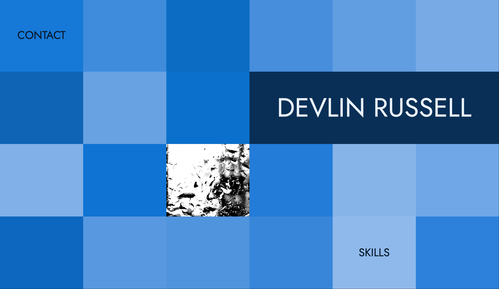

# Portfolio Website
A simple website to display some of my projects



[Deployed Here](http://devlinrussell.net)

## Table of Contents
* [About](#about)
* [Built With](#built-with)
* [Code Examples](#code-examples)
* [Features](#features)
* [Status](#status)
* [Contact](#contact)

## About
The primary purpose of this website is to display projects. It's secondary purpose is to be a portfolio project itself. Thus, it is built using HTML5, CSS3, and some simple client-side JavaScript.

## Built With
* HTML5
* CSS3
* Vanilla JavaScript

## Code Examples
Accessible HTML:
```html
  <button class="contact colorblock">CONTACT</button>
  <div class="contact github">
    <a href="https://github.com/drdevlin" aria-label="contact on github"></a>
  </div>
  <div class="colorblock github"></div>
```

Responsive Grid:
```css
body {
  display: grid;
  grid-template: repeat(4, 25vh) / repeat(6, calc(100vw / 6));
}
.colorblock, .photo {
  overflow: hidden;
}
@media only screen and (min-aspect-ratio: 100/115) and (max-aspect-ratio: 135/100) { /* Medium aspect ratio */
  body {
    grid-template: repeat(4, 25vh) / repeat(4, calc(100vw / 4));
  }
}
@media only screen and (max-aspect-ratio: 100/115) { /* Narrow aspect ratio */
  body {
    grid-template: repeat(5, 20vh) / repeat(3, calc(100vw / 3));
  }
}
```

Fun Styling with JS:
```js
// Then, shuffle the blocks.
const colourBlocks = Array.from(document.querySelectorAll('.colorblock'));
const shuffledColourBlocks = shuffle(colourBlocks);

// And colour them.
shuffledColourBlocks.forEach((block, i) => {
  // Increment the lightness for each block.
  block.style.backgroundColor = `hsl(215, 70%, ${(i + 25) * 1.7}%)`; 
});
```

## Features
Complete
* CSS Grid
* Responsive
* Random colour assignment for different look every time
* Semantic HTML and ARIA (as much as possible)
* Screen reader friendly

To-do list:
* Even better accessibility
* Distinguish links from non-links

## Status
Project is: _in progress_.

## Contact
Created by [@drdevlin](mailto:drdevlin@fastmail.com) Devlin Russell.
